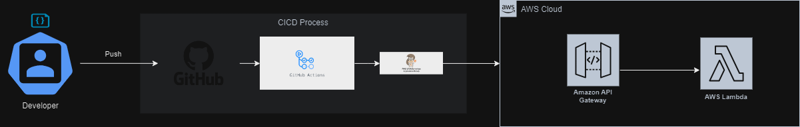

# Inchcape

Technical Test for Inchcape. This repository contains a  service that automatically fetches data from the URL https://jsonplaceholder.typicode.com/posts  and returns the results in the  response. 


## Table of Contents

- [Prerequisites](#prerequisites)
- [Getting Started](#getting-started)
- [Usage](#usage)
- [Contributors](#contributors)

## Prerequisites
Before using this project, ensure you have the following installed:

- [Python](https://www.python.org/)  
- [AWS CLI](https://aws.amazon.com/cli/)  
- [AWS SAM CLI](https://github.com/awslabs/aws-sam-cli)  
## Getting Started

### Process CICD and Architecture

The follow image specifies how to works the process CICD and architecture: 


### Local Configuration

1. Clone the repository:
```
git clone https://github.com/joxpg/inchcape.git
cd inchcape
```
2. Build Local
```
sam build -u -t template.yaml
```
3. Execute local
```
sam local invoke InchcapeFunction
```

## Usage

You can invoke it using browser, postman, curl  or any other method you prefer:

Example using CURL:
```
curl --location 'https://ojsnbuu3pe.execute-api.us-east-2.amazonaws.com/Prod/typicode'
```

## Contributors:

Johann Trigos

